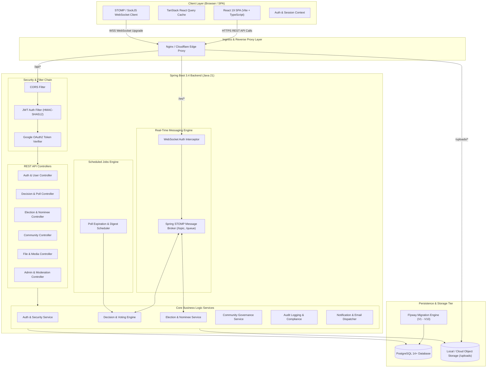
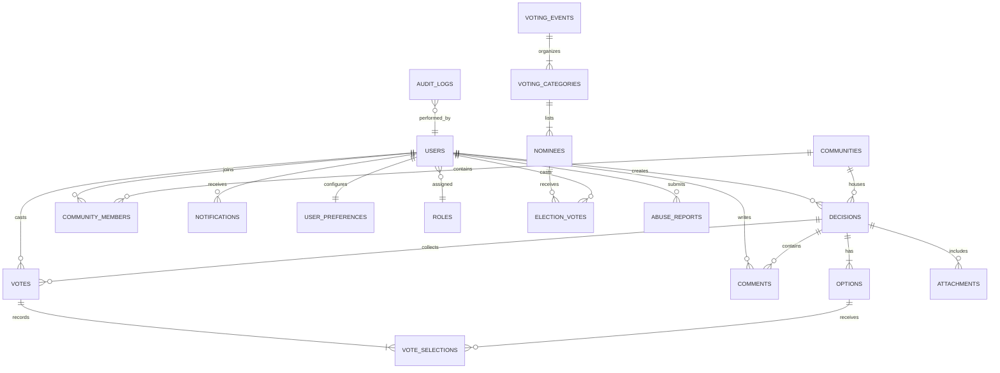

# 🏛️ DecisionHub Platform Architecture

**DecisionHub** is an enterprise-grade, full-stack collaborative decision-making, community governance, and polling platform built with **Java 21 / Spring Boot 3.4.3**, **React 19 / TypeScript / Vite 8**, **PostgreSQL**, and **STOMP/WebSocket**.

---

## 1. High-Level System Architecture

---

## 2. Backend Architecture & Layers

The backend follows **Clean Architecture & Domain-Driven Layering**:

- **Presentation Layer (`com.decisionhub.controller`):** REST endpoints annotated with SpringDoc OpenAPI 3.0 tags and Jakarta Validation (`@Valid`).
- **Security & Authorization (`com.decisionhub.security`, `com.decisionhub.config`):** Stateless JWT filter chain, Google OAuth2 token verification, role-based method authorization (`@PreAuthorize`), and STOMP WebSocket authorization.
- **Service Layer (`com.decisionhub.service.impl`):** Declarative transaction boundaries (`@Transactional`), business rules, scoring computations, and event publishing.
- **Data Access Layer (`com.decisionhub.repository`, `com.decisionhub.specification`):** Spring Data JPA repositories with dynamic JPA Specifications and soft-delete filters.
- **Real-Time Messaging Subsystem (`com.decisionhub.websocket`):** STOMP over WebSocket with SockJS fallback. Publishes live vote updates, discussion comments, and private notifications.
- **Auditing & Reporting (`com.decisionhub.audit`, `com.decisionhub.service.impl.ReportServiceImpl`):** Immutable audit logs, OpenPDF PDF generator, and Apache POI Excel report exports.

---

## 3. Frontend Architecture

The frontend is structured into modular domain features:

- **State Management & Caching:** `@tanstack/react-query` for server state caching, background refetching, and optimistic updates.
- **Real-Time Integration:** `WebSocketContext` with auto-reconnecting STOMP client.
- **Design System:** Tailwind CSS v4, Radix UI headless primitives, Lucide Icons, and Recharts.

---

## 4. Entity-Relationship Data Model

